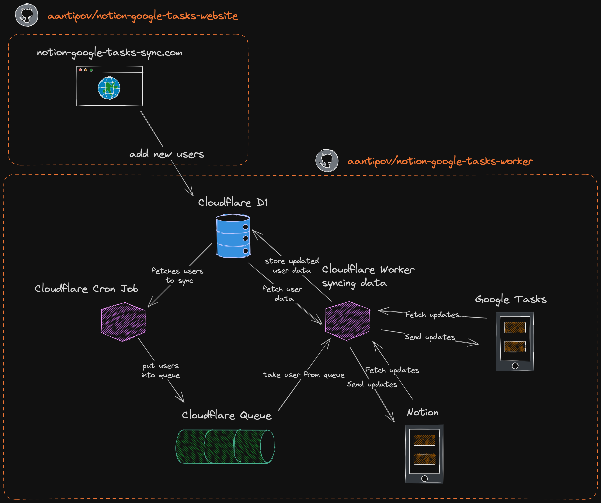

# Notion-Google Tasks Sync Website

## Overview

Notion-Google Tasks Sync is a seamless service allowing users to synchronize their Notion and Google Tasks effortlessly. This repository contains the code for the [front-end website](https://notion-google-tasks-sync.com/), which facilitates user authorization and initial synchronization setup. Built with the Astro framework and hosted on Cloudflare Pages, the website is the starting point for users to integrate their Notion and Google Tasks.

[aantipov/notion-google-tasks-worker](https://github.com/aantipov/notion-google-tasks-worker) is a companion repository for the cron job to sync tasks regularly in the background.



## Features

- **App Authorization**: Users grant permission to the app to access their Notion and Google Tasks on their behalf. This is essential for enabling the synchronization between the two services.
- **Initial Synchronization**: Step-by-step process guiding users through the initial sync of tasks.
- **Secure & Private**: Utilizes Cloudflare D1 for secure data storage, ensuring user data safety.
- **Minimalistic Design**: A user-friendly interface for an effortless setup experience.

## Getting Started

### Prerequisites

- Node.js
- Cloudflare account

### Installation

1. Clone the repository:

```bash
   git clone https://github.com/aantipov/notion-google-tasks-website.git
```

2. Install dependencies:

```bash
pnpm install
```

3. Configure environment variables for Cloudflare and API access.

### Running Locally

Run the following command to start the development server:

```bash
pnpm run dev
```

## Deployment

This project is deployed on Cloudflare Pages. Follow Cloudflare's documentation for deploying Astro projects to set up continuous deployment.

## License

This project is licensed under the MIT License - see the LICENSE file for details.
